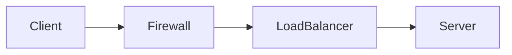

# Packet & Path 维护与发布手册

本文档说明如何修改 `Packet & Path` 的文章、页面结构和外观，并将改动安全发布到线上。

## 1. 核心发布逻辑

网站采用以下发布链路：

```text
Windows 本地源码
    -> 本地预览和构建检查
    -> Git commit
    -> 按授权同步并推送 master 与线上对齐分支 blog-version-02
    -> Wrangler dry run 和一次显式 Cloudflare Worker 部署
    -> https://www.next-hop.tech/ 生效
```

各平台职责：

| 位置 | 职责 |
|---|---|
| `D:\Projects\Personal Blog\website` | 日常修改、预览和验证的主要入口。 |
| `https://github.com/huangzesheng0117/packet-and-path` | 个人博客源码中心和版本历史。 |
| Cloudflare Workers | 自动构建和发布，不作为日常页面编辑入口。 |
| `https://next-hop.tech/`、`https://www.next-hop.tech/` | 面向访问者的正式网站，均绑定到 `firefly` Worker。 |

除域名、构建设置、环境变量等平台配置外，不要直接在 Cloudflare 修改页面内容。

## 2. 开始修改前

打开 PowerShell：

```powershell
Set-Location -LiteralPath 'D:\Projects\Personal Blog\website'
git status -sb
git branch -vv
git fetch origin --prune
..\switch-blog-version.ps1 -Status
```

要求：

- `git status` 不应有来源不明的未提交文件。
- `fetch` 后先核对本地版本分支与远端 SHA，再决定在哪个版本环境修改；不要把 `pull origin master` 无条件合并进任意当前分支。
- `Case` 目录是私有案例原始资料，不属于网站 Git 仓库，不能直接发布。

### 2.1 中英文双版本同步规则

本项目默认同时维护英文和简体中文两个版本。今后凡是涉及用户可见界面、文字、文章、图片文字、元数据或交互提示的改动，必须在同一次修改中同步完成英文版和中文版；除非需求明确说明只修改其中一种语言。

- 英文是网站默认显示语言，简体中文通过导航栏语言按钮切换；按钮文字必须与当前页面语言一致：英文界面显示 `English`，中文界面显示“中文”。
- 导航、标题、按钮、提示、统计、分类、标签、页脚、无障碍标签和页面标题等 UI 文案必须同时维护英文与中文，不得只硬编码默认语言。
- 通用 UI 文案优先使用 `src/components/features/LanguageManager.astro` 中的语言映射，组件自有文案使用成对的 `data-lang-en`、`data-lang-zh` 属性。
- 中文文章正文保存在 `src/content/posts/`，对应英文正文及英文专用资源保存在 `src/content-locales/`；同一篇文章的两个版本使用同一路由，由语言按钮切换，不得发布成两篇独立文章。
- 修改文章时必须同步核对标题、摘要、分类、标签、正文、目录、图片和图中文字。未经明确授权，不得为了保持两种语言一致而擅自增删改原文内容。
- 布局和样式必须分别检查中英文。需要单独修正英文或中文排版时，使用 `html[data-site-lang="en"]` 或 `html[data-site-lang="zh-CN"]` 限定作用范围，避免影响另一语言。
- 完成后至少验证英文默认状态、中文切换状态、刷新后的语言持久化、跨页面切换以及文章正文同步切换。

## 3. 常见修改入口

| 修改目标 | 路径 |
|---|---|
| 新增、编辑或删除文章 | `src/content/posts/` |
| 英文文章、英文页面和英文专用资源 | `src/content-locales/` |
| 关于我 | `src/content/spec/about.md` |
| 网站标题、域名、主题色和页面开关 | `src/config/siteConfig.ts` |
| 作者名称、简介和社交链接 | `src/config/profileConfig.ts` |
| 顶部导航栏 | `src/config/navBarConfig.ts` |
| 公告 | `src/config/announcementConfig.ts` |
| 背景和壁纸 | `src/config/backgroundWallpaper.ts` |
| 文章封面规则 | `src/config/coverImageConfig.ts` |
| 侧边栏布局 | `src/config/sidebarConfig.ts` |
| 字体、特效、评论和统计 | `src/config/` 下对应配置文件 |
| 页面路由和结构 | `src/pages/`、`src/layouts/` |
| 页面组件和视觉样式 | `src/components/`、`src/styles/` |
| 公共静态资源 | `public/` |
| 受源码管理的图片 | `src/assets/` |
| 当前前端设计、字体和导航维护说明 | `docs/REFERENCE_IMPLEMENTATION.md` |

结构和组件修改比 Markdown 文章修改风险更高，应先阅读
`docs/REFERENCE_IMPLEMENTATION.md`，保持改动范围小，并同时检查桌面端和移动端。

## 4. 新增文章

可以使用脚本创建文章：

```powershell
pnpm new-post incident-name
```

也可以在 `src/content/posts/` 下创建 Markdown 文件。常用 Frontmatter：

```markdown
---
title: "文章标题"
published: 2026-07-25
updated: 2026-07-26
description: 一句话说明问题背景和文章价值。
image: ./cover.webp
tags: [BGP, 故障排查, 数据中心]
category: 网络故障复盘
lang: zh-CN
draft: true
pinned: false
author: ZeSheng Huang
sourceLink: ""
licenseName: CC BY-NC-SA 4.0
licenseUrl: https://creativecommons.org/licenses/by-nc-sa/4.0/
comment: false
password: ""
passwordHint: ""
---
```

写作阶段保持 `draft: true`。完成脱敏、校对和本地验证后再改为 `draft: false`。

### 4.1 Frontmatter 字段

字段定义以 `src/content.config.ts` 为准：

| 字段 | 必填 | 默认值 | 说明 |
|---|---|---|---|
| `title` | 是 | 无 | 文章标题，应准确描述问题或项目。 |
| `published` | 是 | 无 | 首次发布日期，使用 `YYYY-MM-DD`。 |
| `updated` | 否 | 未设置 | 实质修改文章后填写最近更新日期。 |
| `description` | 否 | 空字符串 | 首页卡片和搜索摘要，说明背景、问题和价值。 |
| `image` | 否 | 空字符串 | 封面图，可使用文章相对路径、`public` 路径或 HTTPS URL。 |
| `tags` | 否 | `[]` | 技术关键词，例如 `BGP`、`EVPN`、`故障排查`。 |
| `category` | 否 | 空字符串 | 稳定的一级分类，不要为每篇文章创建新分类。 |
| `lang` | 否 | 站点默认语言 | 仅当文章语言不同于站点默认语言时设置。 |
| `draft` | 否 | `false` | `true` 时不公开，写作和脱敏阶段必须设为 `true`。 |
| `pinned` | 否 | `false` | `true` 时在文章列表置顶，应只用于少量代表作。 |
| `author` | 否 | 站点作者 | 需要覆盖默认署名时设置。 |
| `sourceLink` | 否 | 空字符串 | 改编、翻译或引用外部资料时填写原始来源。 |
| `licenseName` | 否 | 站点许可证 | 覆盖当前文章的许可证名称。 |
| `licenseUrl` | 否 | 站点许可证 | 与 `licenseName` 对应的许可证链接。 |
| `comment` | 否 | `true` | 是否允许评论；评论系统未启用时建议保持 `false`。 |
| `password` | 否 | 空字符串 | 设置后启用文章密码保护。不能用它保护真正敏感的生产资料。 |
| `passwordHint` | 否 | 空字符串 | 与 `password` 配合使用的提示文字，不得泄露密码。 |

不要手工设置 `prevTitle`、`prevSlug`、`nextTitle`、`nextSlug`，这些字段仅供主题内部使用。

参考文章中的 `slug` 字段不在 Firefly 6.15.0 当前内容模型中。文章 URL 由文件路径生成：

```text
src/content/posts/bgp-route-leak.md       -> /posts/bgp-route-leak/
src/content/posts/bgp-route-leak/index.md -> /posts/bgp-route-leak/
```

发布后不要随意重命名文件或目录，否则旧链接会失效。若确需改 URL，应同时配置重定向。

### 4.2 文件和目录命名

- 文件和目录使用小写英文、数字和连字符，例如 `bgp-route-leak`。
- 不使用空格、中文、下划线或无意义编号作为公开 URL。
- 单文件短文可使用 `topic-name.md`。
- 带封面、拓扑和抓包图片的文章使用独立目录及 `index.md`。
- 文件名保持简短、稳定，并能表达文章主题。

推荐结构：

```text
src/content/posts/
└── bgp-route-leak/
    ├── index.md
    ├── cover.webp
    ├── topology.webp
    └── packet-flow.webp
```

### 4.3 图片和媒体资源

- 文章专用图片放在文章同目录，使用 `./image.webp` 相对引用。
- 多篇文章共用且需要源码优化的图片放在 `src/assets/`。
- 无需 Astro 优化的公共文件放在 `public/`，引用路径以 `/` 开头。
- 优先使用 WebP 或 AVIF，控制图片尺寸和文件体积。
- 每张图片填写有意义的替代文本，不使用 `image1`、`截图` 等无信息描述。
- 网络图片必须使用 HTTPS，并评估第三方防盗链、可用性和隐私风险。
- 不直接上传含真实地址、设备名、客户名、账号或完整生产拓扑的截图。

Markdown 图片示例：

```markdown

```

多图对比可使用 Firefly 图片网格：

```markdown
[grid]


[/grid]
```

### 4.4 Markdown 扩展语法

代码块必须标注语言：

````markdown
```text
display bgp routing-table peer
```
````

行内和块级 KaTeX 公式：

```markdown
行内公式：$E = mc^2$

$$
\sum_{i=1}^{n} i = \frac{n(n+1)}{2}
$$
```

Mermaid 图表：

````markdown

````

当前站点使用 GitHub 风格提醒框：

```markdown
> [!NOTE]
> 补充背景信息。

> [!TIP]
> 可复用的排查技巧。

> [!WARNING]
> 可能影响生产业务的操作。

> [!CAUTION]
> 执行前必须确认回滚条件。
```

GitHub 仓库卡片：

```markdown
::github{repo="CuteLeaf/Firefly"}
```

视频使用平台提供的 HTTPS 嵌入地址，并设置标题、宽度和 `allowfullscreen`：

```html
<iframe
  width="100%"
  height="468"
  src="https://player.bilibili.com/player.html?bvid=BVxxxxxxxx&autoplay=0"
  title="演示视频"
  frameborder="0"
  allowfullscreen>
</iframe>
```

不要启用自动播放。发布前在桌面端和移动端检查 iframe 是否溢出页面。

### 4.5 SEO 和链接稳定性

- 标题直接说明项目、现象或根因，避免“问题记录”“随便写写”等模糊名称。
- `description` 独立成句，概括业务背景、关键技术和解决结果。
- 每篇文章选择一个稳定分类，并控制在 3 至 6 个高相关标签。
- 使用清晰的标题层级，正文从 `##` 开始，不跳级堆叠标题。
- 内部链接使用站点正式路径并保留结尾 `/`。
- 外部资料必须给出来源；引用内容与个人实践结论应明确区分。
- 更新技术结论时填写 `updated`，不要篡改原始 `published` 日期。
- 发布后保持 URL 稳定；删除或迁移文章时评估重定向和外部链接影响。

### 4.6 内容质量和安全检查

- 命令、日志、抓包和拓扑必须真正支撑文章结论。
- 明确区分事实、推测、临时规避方案和最终根因。
- 不把厂商文档内容包装成个人实际项目经验。
- 不发布无法确认授权的客户材料或第三方全文。
- 密码文章仍会把加密内容部署到公开静态站点，不适合存储机密资料。
- 发布前按第 12 节完成客户与生产数据脱敏。

建议案例文章结构：

1. 背景和业务影响。
2. 网络架构与完整数据流。
3. 初始现象和已有告警。
4. 排查假设、命令、日志和抓包证据。
5. 根因和错误判断。
6. 临时止损、永久修复及回滚方案。
7. 验证结果和可复用经验。

## 5. 编辑或删除文章

编辑文章时直接修改 `src/content/posts/` 中对应的 `.md` 或 `.mdx` 文件。

删除文章时：

1. 删除对应 Markdown/MDX 文件。
2. 删除仅供该文章使用的本地图片。
3. 搜索导航、其他文章或配置中是否仍引用旧 URL。
4. 本地构建并检查是否出现失效链接。

只做少量文字修改时可以使用 GitHub 网页编辑器，但页面结构、样式和多文件修改应在本地完成并预览。

## 6. 本地预览

在项目根目录执行：

```powershell
pnpm dev
```

浏览器打开：

```text
http://127.0.0.1:5173/
```

项目使用 `5173` 而不是 Astro 默认的 `4321`，因为本机 Windows 环境拒绝绑定 `4321`。

预览检查至少包括：

- 首页、文章页、分类、标签和关于我页面。
- 亮色和暗色模式。
- 桌面宽屏和手机窄屏。
- 导航菜单、站内搜索、代码块、图片和图表。
- 文章中的客户信息和生产数据是否已彻底脱敏。

按 `Ctrl+C` 停止本地开发服务器。

## 7. 发布前验证

```powershell
pnpm check
pnpm build
git diff --check
git status
```

预期结果：

- `pnpm check` 为 0 errors、0 warnings。
- `pnpm build` 成功生成 `dist/` 和 Pagefind 搜索索引。
- `git diff --check` 没有空白符错误。
- `git status` 只显示本次预期修改。
- 所有用户可见改动均已同时检查英文版和中文版，语言按钮、刷新持久化及文章正文切换结果一致。

`pnpm type-check` 也是标准验证项。若它失败，必须记录本次实际错误并判断是否为已确认基线；不得沿用历史文档中的旧错误说明直接跳过。

## 8. 提交并推送 GitHub

GitHub 提交、版本分支同步、原子推送和远端哈希核对统一按照 [`docs/RELEASE_WORKFLOW.md`](RELEASE_WORKFLOW.md) 执行。该文档是发布操作的唯一来源；本维护文档不再重复维护另一套命令。

## 9. Cloudflare 生产部署

GitHub 的 `master` 更新可能触发 Cloudflare 自动构建；Codex 的标准生产发布以 [`docs/RELEASE_WORKFLOW.md`](RELEASE_WORKFLOW.md) 中经过 `--dry-run` 的显式 Wrangler 部署和 Version ID 为完成凭据。

固定构建与部署命令仍为 `pnpm build` 和 `pnpm exec wrangler deploy`。

`wrangler.jsonc` 声明 `next-hop.tech` 和 `www.next-hop.tech` 为 Custom Domain。不要只在控制台临时添加域名而不更新配置，否则后续 Wrangler 部署可能移除未声明的域名触发器。

部署后必须验证 `https://next-hop.tech/` 和 `https://www.next-hop.tech/`，不能只检查其中一个域名。具体缓存绕过、HTTP 检查、视觉检查和回滚步骤见统一发布文档。

若页面仍是旧版本：

1. 确认 GitHub `master` 已出现最新 commit。
2. 确认 Cloudflare 已触发该 commit 的构建。
3. 检查 `pnpm build` 或 Wrangler 部署日志。
4. 使用无痕窗口或 `Ctrl+F5` 排除浏览器缓存。

### 9.1 访问性能基线与 Cloudflare IP 优选预案

截至 2026-07-25，中国大陆各省及全球不同测试节点的页面访问时间约为 `1.5s-3s`，当前符合预期，因此不启用 IP 优选。

参考资料：<https://www.fqzlr.com/posts/cloudflare-ip-optimize-and-writing/>

只有出现以下情况时才重新评估：

- 多个地区连续出现明显高于当前基线的加载时间，而非单次网络波动。
- 中国大陆主要访问网络持续超时、首字节时间过高或静态资源大量失败。
- 已排除图片体积、外部资源、构建产物、浏览器缓存和 Cloudflare 部署异常。
- 能够安排独立测试域名、验证窗口和完整回滚。

优先优化顺序：

1. 压缩图片并改用本地 WebP/AVIF，避免不稳定的随机图片 API。
2. 减少第三方字体、脚本、播放器和跨域资源。
3. 检查 Cloudflare 缓存命中、资源 Cache-Control 和构建产物体积。
4. 检查首页组件、动画和大体积 JavaScript 对首屏的影响。
5. 上述措施不足时，再评估 DNS/IP 优选。

参考文章中的 IP 优选思路：

1. 在 Cloudflare 为目标主机添加覆盖全部路径的 Worker 路由，例如 `www.next-hop.tech/*`。
2. 新建测试 DNS 记录，例如 `speed-test.next-hop.tech`。
3. 将测试记录指向经过测速选择的 Cloudflare 优选地址或第三方优选 CNAME，例如文章所述的 `*.cf.090227.xyz`。
4. 按参考方案关闭该测试记录的 Cloudflare 代理，使客户端直接解析到所选节点。
5. 在不同运营商和地区对原域名与测试域名进行延迟、TLS、首字节、完整加载和可用性对比。
6. 只有测试结果稳定且安全评估通过，才考虑将正式 `www` 记录切换到优选链路。

> [!WARNING]
> 该方案依赖第三方优选域名并关闭 Cloudflare DNS 代理，可能引入供应链、DNS、TLS、证书续期和可用性风险，也可能与当前 Workers Custom Domain 配置冲突。不得直接在生产域名上试验。

实施前记录：

- Cloudflare 中现有 `www` 和根域 DNS 记录。
- Worker `firefly` 的 Domains & Routes 配置。
- 当前 HTTPS 证书和 Always Use HTTPS 状态。
- 至少三组国内运营商和三组海外节点的基线数据。
- 优选服务提供方、解析链路、TTL 和故障责任边界。

验证项目：

- `https://www.next-hop.tech/` 的证书、SNI 和完整证书链正常。
- 首页、文章、CSS、JavaScript、图片、RSS、Sitemap 和 Pagefind 搜索均返回成功。
- HTTP 正确跳转 HTTPS，不出现重定向循环。
- Cloudflare Worker 仍命中正确版本，没有进入 Spaceship 停放页或其他源站。
- 国内不同运营商的中位数和高分位加载时间确有持续改善。
- 海外访问、IPv6 和异常节点没有显著退化。

回滚步骤：

1. 恢复实施前记录的 Cloudflare DNS 和 Worker 自定义域配置。
2. 删除测试或第三方优选 CNAME。
3. 恢复 Cloudflare 代理状态和原 TTL。
4. 等待 DNS 生效后重新检查 HTTPS、Worker 路由和页面内容。
5. 使用多个公共 DNS 和地区节点确认解析已恢复。

如果第三方优选服务无法说明节点来源、稳定性、隐私策略或维护责任，则不采用该方案。对于长期且严格的中国大陆访问质量要求，应优先评估具备合规条件的中国大陆 CDN/托管方案，而不是长期依赖非官方优选地址。

## 10. 回滚错误发布

先查看提交历史：

```powershell
git log --oneline -10
```

使用 `git revert` 创建安全的反向提交，然后按统一发布流程同步应发布的分支：

```powershell
git revert <错误提交的哈希>
```

不要只推送 `master` 而让线上对齐分支失真。按照 [`docs/RELEASE_WORKFLOW.md`](RELEASE_WORKFLOW.md) 完成验证、原子推送和 Cloudflare 回滚/部署；不要用 `git reset --hard` 或强制推送破坏公开分支历史。

## 11. Fork 与上游 Firefly

本项目有两个 Git 远程：

```text
origin   https://github.com/huangzesheng0117/packet-and-path.git
upstream https://github.com/CuteLeaf/Firefly.git
```

- `git push origin master` 只更新个人 Fork，不影响官方 Firefly。
- 官方项目不会自动同步到个人 Fork。
- 只有主动向官方提交 Pull Request 且被维护者合并，才会影响官方项目。

同步官方更新时执行：

```powershell
git fetch upstream
git log --oneline master..upstream/master
git merge upstream/master
pnpm check
pnpm build
```

由于本项目已经修改配置和内容，上游合并可能产生冲突。不要配置无人值守的自动同步；应先审查上游变更，再合并和测试，并按统一发布流程决定是否同步 `master`、`blog-version-02` 和本地版本 01。

## 12. 私有案例资料与脱敏

私有资料位于：

```text
D:\Projects\Personal Blog\Case
```

公开文章不得直接复制原始配置和截图。发布前至少处理：

- 客户、组织、人员和供应商敏感名称。
- 真实公网/私网地址、ASN、VLAN、域名和设备名。
- 账号、口令、哈希、Token、密钥和 License。
- 联系方式、序列号、资产编号和工单号。
- 能还原生产网络的完整拓扑和安全策略。

使用 RFC 5737、RFC 3849 等文档保留地址，并将配置裁剪为支撑技术结论的最小片段。

## 13. 本地维护参考资料

fqzlr.com 的 18 篇文章快照位于：

```text
docs\reference\fqzlr-posts
```

刷新归档：

```powershell
powershell -ExecutionPolicy Bypass -File .\scripts\archive-fqzlr-posts.ps1
```

第三方文章 HTML 和 RSS 全文被 `.gitignore` 排除，只保存在本机，不会上传到公开 GitHub，也不得作为本站文章重新发布。

## 14. 凭据安全

- GitHub、Cloudflare 密码和 API Token 不得写入源码、Markdown 或配置文件。
- Wrangler OAuth 凭据保存在用户配置目录，不属于仓库。
- `.env` 和 `.env.production` 已被 Git 忽略。
- 提交前使用 `git diff --cached` 检查暂存内容。
