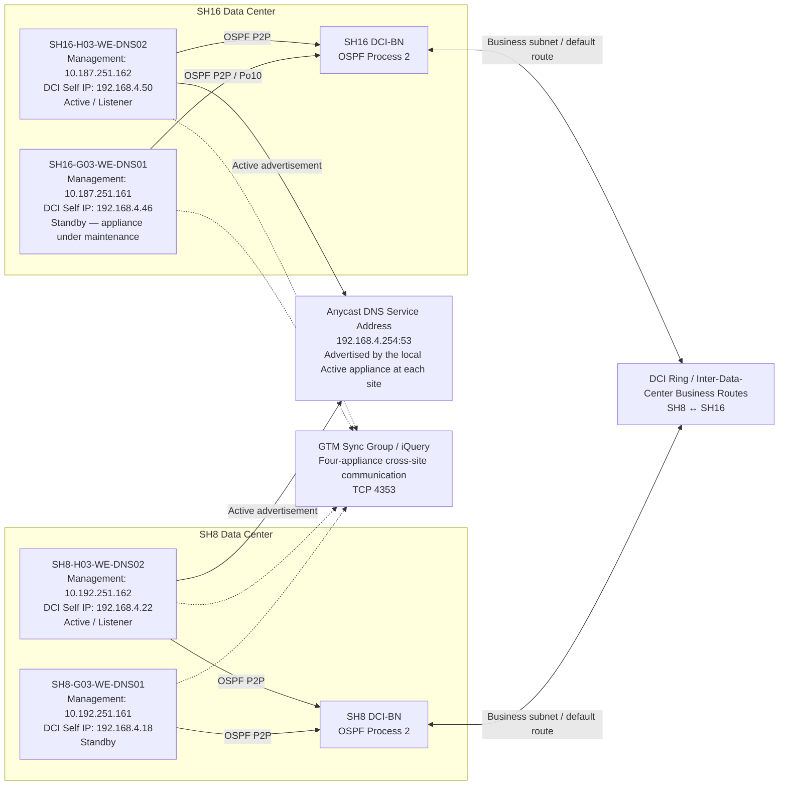
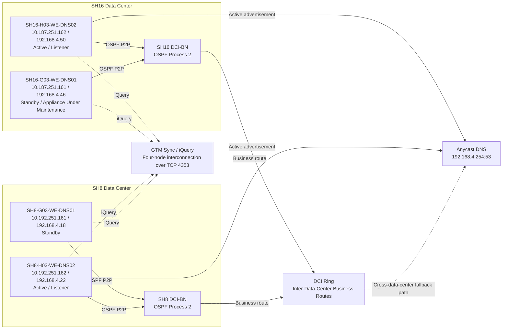
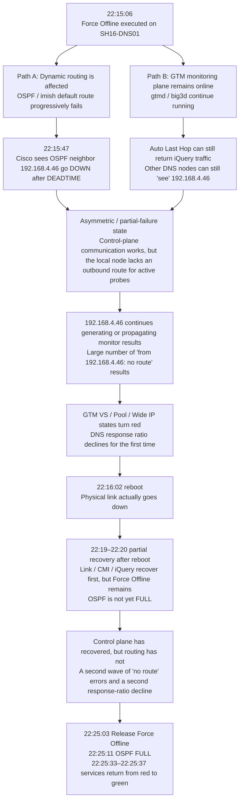

## 00. Where the Incident Began

During a maintenance window, maintenance was performed on one F5 DNS appliance in an active-active data-center architecture: `SH16-G03-WE-DNS01.COM`.

Within the local SH16 HA pair, this appliance was the **Standby** unit. The `192.168.4.254:53` Anycast DNS listener for the SH16 data center was actually hosted by the other, Active appliance: `SH16-H03-WE-DNS02.COM`.

The most intuitive expectation was straightforward:

- The appliance under maintenance was the Standby unit.
- The Active appliance remained online.
- The DNS service address did not fail over to the appliance being maintained.
- Under normal circumstances, there should therefore have been no material degradation across the DNS/GTM service plane.

Grafana showed exactly the opposite. During the maintenance window, the internal DNS response ratio experienced **two pronounced drops**.

**Figure 1. The DNS response ratio dropped twice during the incident window**

> **Translated chart text**
>
> Panel title: **Internal DNS Response Ratio**
>
> | Series | Maximum |
> |---|---:|
> | `10.187.251.162` — Global Response Ratio | 1 |
> | `10.192.251.162` — Global Response Ratio | 0.997 |
> | `10.187.251.162` — Preferred Response Ratio | 1 |
> | `10.192.251.162` — Preferred Response Ratio | 0.997 |
>
> The chart covers approximately 21:54–22:48. It shows a brief first dip around 22:16–22:17 and a deeper, sustained second dip around 22:22–22:26, followed by recovery at approximately 22:27.

**This was the question that launched the entire investigation:**

> Why would maintenance on a Standby DNS appliance reduce the overall response rate of a dual-data-center DNS/GTM platform?

There was no immediate answer. As the evidence later showed, an investigation focused only on HA failover and listener movement would almost certainly have gone in the wrong direction.

---

## 01. Production Architecture

The dual-data-center internal WE-DNS platform consists of four appliances:

| Data center | Appliance | Management IP | DCI Self IP | HA role when data was collected after the incident |
|---|---|---:|---:|---|
| SH8 | SH8-G03-WE-DNS01 | 10.192.251.161 | 192.168.4.18 | Standby |
| SH8 | SH8-H03-WE-DNS02 | 10.192.251.162 | 192.168.4.22 | Active |
| SH16 | SH16-G03-WE-DNS01 | 10.187.251.161 | 192.168.4.46 | Standby — **the appliance under maintenance** |
| SH16 | SH16-H03-WE-DNS02 | 10.187.251.162 | 192.168.4.50 | Active |

Each data center has its own HA pair, and both sites advertise the same Anycast DNS service address:

```text
192.168.4.254:53
```

All four appliances also participate in the same GTM/DNS environment. This includes cross-site sync/iQuery communication, monitoring-state propagation, and health checks for various GTM Servers and Virtual Servers.

**Figure 2. Minimum production topology directly relevant to the incident**



WE-DNS connects at Layer 3 through the DCI-BN devices. OSPF runs between WE-DNS and DCI-BN, while a DCI ring carries the business subnets and DNS-related routes between the two data centers.

**Figure 3. Redrawn and sanitized Anycast DNS access architecture**



The key design points are as follows:

1. The two SH8 WE-DNS appliances operate as an active-standby pair, as do the two SH16 appliances. All four belong to a cross-data-center cluster and synchronize configuration.
2. Each WE-DNS appliance connects to a single DCI-BN over a bonded pair of 10-Gbps links, using Layer 3 connectivity.
3. OSPF point-to-point adjacencies run between WE-DNS and DCI-BN. DCI-BN uses OSPF Process 2.
4. WE-DNS uses OSPF `redistribute kernel` to advertise the locally hosted `192.168.4.254` DNS service address. Only the current Active appliance listens on and advertises that address.
5. Each WE-DNS appliance has a default static route whose next hop is the Layer 3 interconnect address on DCI-BN. DCI-BN redistributes the relevant routes learned by OSPF Process 2 into BGP and uses a route map to control the advertisement scope.
6. When servers in SH8 or SH16 access `192.168.4.254`, DCI-BN selects the local WE-DNS path based on route metric.
7. If one Active WE-DNS appliance fails, its Standby peer takes over and advertises `192.168.4.254`, allowing local traffic to remain within the same data center.
8. If both WE-DNS appliances at one site become unavailable, traffic to `192.168.4.254` can be redirected over the DCI ring to a WE-DNS appliance at the peer site.
9. Routes in the `192.168.4.x` range are used internally by the active-active environment and are not advertised to unrelated data centers.

This quickly led to the first important insight:

> **“The Standby appliance does not host the local listener” does not mean “the Standby appliance has no role in the wider GTM environment.”**

Even when a DNS appliance is not the Active listener for the local `192.168.4.254` address, it may still:

- Belong to the GTM sync group.
- Communicate with other BIG-IP DNS appliances over iQuery.
- Run `gtmd` and `big3d`.
- Act as the execution node for certain monitors or probers.
- Participate in OSPF and business-subnet routing.

At this point, the scope of the investigation expanded beyond HA failover to a broader question: **Was there a state mismatch among the DNS listener, the GTM control plane, the health-check plane, and the dynamic-routing plane?**

---

## 02. Baseline Verification

The first round of data collection focused on five questions:

1. Was `SH16-DNS01` actually the Standby appliance?
2. Which Traffic Group owned `192.168.4.254`?
3. Were the two SH16 DNS appliances In Sync?
4. Were GTM_WGSH8 and GTM_WGSH16 healthy at the time of inspection?
5. Were the OSPF neighbors and routes healthy?

The following commands were collected:

```bash
tmsh show sys failover
tmsh show cm sync-status
tmsh show cm traffic-group
tmsh show cm device-group /Common/group_HA
tmsh show ltm virtual-address /Common/192.168.4.254

tmsh list cm traffic-group /Common/traffic-group-1 all-properties
tmsh list ltm virtual-address /Common/192.168.4.254 all-properties
tmsh list ltm virtual /Common/listener_TCP /Common/listener_UDP all-properties

tmsh show gtm server /Common/GTM_WGSH8
tmsh show gtm server /Common/GTM_WGSH16
```

This first pass quickly confirmed that:

- SH16-DNS01 was indeed Standby.
- SH16-DNS02 was Active.
- The configuration was In Sync.
- `traffic-group-1` was healthy.
- `192.168.4.254` was a floating virtual address.
- The apparent HA state showed no sign that the Standby appliance had incorrectly taken ownership of the listener.

The simplest initial explanation — an unexpected active-standby role issue — was therefore largely ruled out.

## 03. Timeline

### 3.1. The Grafana Anomaly

The Grafana graph showed two distinct troughs.

This meant that the right question was no longer:

> “Did DNS briefly flap when the appliance rebooted?”

Instead, we needed to ask:

> “When did the first drop begin? Why was there a second drop? What system state corresponded to each one?”

We therefore aligned the logs from all four DNS appliances and the Cisco DCI-BN devices on a single timeline.

### 3.2. `no route` Before the Reboot

The SH16-DNS01 logs showed:

```text
Jun  5 22:15:06 SH16-G03-WE-DNS01.COM notice sod[9058]:
010c0044:5: Command: go offline all tmsh.

Jun  5 22:15:06 SH16-G03-WE-DNS01.COM notice sod[9058]:
010c0055:5: Forced offline for traffic group traffic-group-1.
```

In the **same second**, GTM monitors began reporting:

```text
Jun  5 22:15:06 ... Monitor instance /Common/tcp_half_9818
10.186.200.88:0 UP --> DOWN from 192.168.4.46 (no route)

Jun  5 22:15:06 ... VS vs_7core.example.internal_10.186.200.88
state change green --> red
( Monitor /Common/tcp_half_9818 from 192.168.4.46 : no route)
```

The actual reboot was not logged until:

```text
Jun  5 22:16:02 SH16-G03-WE-DNS01.COM err logger[30977]:
shutting down for system shutdown on behalf of root
```

The sequence was unambiguous:

```text
22:15:06  Force Offline
    ↓
22:15:06  Monitor "no route" errors begin
    ↓
22:16:02  The appliance actually begins rebooting
```

This evidence directly disproved one of our earliest and most natural assumptions:

> **The first service degradation was not caused by the reboot, because the anomaly began almost one minute before the reboot.**

From this point onward, the investigation shifted from `reboot` to `Force Offline`.

---

## 04. Network-Side Corroboration

F5 logs alone still left open another possibility:

- `gtmd` itself might have been reporting an internal error.
- Another F5 component might have entered an abnormal state.
- The underlying network might not actually have changed.

We therefore checked the same time window on the Cisco DCI-BN device.

Cisco logged:

```text
2026 Jun  5 22:15:47.561 SH16-G03-DCI-BN-SW01
%OSPF-5-ADJCHANGE: ospf-2 [3860]
Nbr 192.168.4.46 on port-channel10 went DOWN

2026 Jun  5 22:15:47.561 SH16-G03-DCI-BN-SW01
%OSPF-5-NBRSTATE: Process 2,
Nbr 192.168.4.46 on port-channel10 from FULL to DOWN, DEADTIME
```

The physical port-channel did not actually go down until:

```text
2026 Jun  5 22:16:03.144 ...
Interface port-channel10 is down (No operational members)
```

Putting the three log sets together produced a highly informative timeline:

| Time | Event |
|---|---|
| 22:15:06 | Force Offline |
| 22:15:06 | Monitors begin reporting `no route` |
| 22:15:47 | Cisco declares OSPF neighbor 192.168.4.46 DOWN after DEADTIME |
| 22:16:02 | F5 begins rebooting |
| 22:16:03 | Cisco Po10 physical link goes down |

The evidence chain had now advanced from “F5 says it has no route” to:

> **After Force Offline, the dynamic-routing neighbor genuinely disappeared before the reboot began.**

This was one of the most important timeline-based falsifications in the entire investigation.

---

## 05. Mechanism Analysis

At this point, another contradiction emerged:

- The OSPF adjacency for `192.168.4.46` was down.
- Yet the logs still contained large numbers of GTM monitor results reported as “from 192.168.4.46.”

If the appliance had gone completely offline, it should have lost both its routing capability and its role in active probing.

**That was not what happened.**

We therefore went beyond the site configuration and correlated the official product behavior, TAC findings, and logs.

### 5.1. Force Offline

We focused on the following MyF5 articles:

- [`K00409413`](https://my.f5.com/manage/s/article/K00409413): A BIG-IP system in a disabled/offline state does not advertise routes through advanced dynamic-routing protocols.
- [`K15122`](https://my.f5.com/manage/s/article/K15122): Force Offline does not automatically stop BIG-IP DNS metrics collection or monitoring functions.
- [`K11661449`](https://my.f5.com/manage/s/article/K11661449): BIG-IP DNS software upgrade and maintenance procedures address stopping `big3d` and `gtmd` separately.
- [`K39164203`](https://my.f5.com/manage/s/article/K39164203): Dynamic routing is tied to the state of `tmrouted/imish`.

The critical point was that the official Force Offline procedure explicitly treats BIG-IP DNS monitoring as a separate concern: to stop monitoring, `big3d` must be stopped independently.


This reconciled the two observations that had previously appeared contradictory:

```text
Force Offline
├── Affects HA and advanced dynamic-routing behavior
└── Does not automatically stop DNS gtmd/big3d services
```

In other words, the appliance could enter a highly hazardous partial-failure state:

> **Its routing plane could no longer originate traffic normally, while its GTM monitoring plane remained alive.**

### 5.2. Auto Last Hop

F5 TAC then confirmed another key behavior: iQuery requests sent to `192.168.4.46` by the other three DNS appliances could still receive responses.

The reason was **Auto Last Hop**.

From the perspective of the other three DNS appliances:

```text
“192.168.4.46 still answers my iQuery requests, so it appears to be alive.”
```

From SH16-DNS01's perspective when it attempted to originate traffic:

```text
“My dynamic route or default outbound path is broken, so active probes fail with no route.”
```

This was the **asymmetric perspective / partial-failure state** later described in the incident report.

**Figure 5. Failure mechanism: how forcing a Standby DNS appliance offline contaminated GTM health-check state**



At this point, the first drop in service response was largely explained:

1. Force Offline disrupted dynamic routing.
2. `gtmd` and `big3d` did not stop with it.
3. Auto Last Hop allowed the other DNS appliances to retain partial iQuery visibility of the appliance.
4. `192.168.4.46` continued to participate in or propagate health-check state.
5. Because it no longer had a valid outbound route, many monitor results became `no route`.
6. Virtual Server, Pool, and Wide IP states turned red.
7. The DNS response ratio fell.

---

## 06. The Second Anomaly

If Force Offline explained the first drop, what caused the second, deeper trough in Grafana?

This question forced us to examine each stage between reboot and full service restoration, rather than assuming that “boot complete” meant “recovery complete.”

### 6.1. State Persistence

After SH16-DNS01 rebooted, the logs showed:

```text
Jun  5 22:19:30 ... Forced offline for traffic group traffic-group-1.
Jun  5 22:19:30 ... Forced offline
```

In other words:

> **The reboot did not automatically clear the pre-existing Forced Offline state.**

### 6.2. Misaligned Recovery

The following events then occurred:

```text
22:20:15  tmrouted starting
22:20:20  trunk_DCI is UP
22:20:21  CMI peer connection established
22:20:27  iQuery SSL handshake complete
22:20:27  Box 192.168.4.46 red --> green
22:20:31  GTM changed state from DOWN to UP
```

From the GTM/iQuery perspective, the appliance appeared to be back.

On the Cisco side, however, the dynamic-routing adjacency did not truly recover until:

```text
22:25:11  OSPF Nbr 192.168.4.46 went FULL
```

This created a critical **partial-recovery window** between 22:20 and 22:25:

```text
Link:             UP
CMI:              UP
iQuery:           UP
GTM Box:          green
Forced Offline:   still in effect
OSPF:             not yet FULL
Outbound routing: still incomplete
```

This explains the second drop in the response ratio:

> The control plane recovered first, leading the other DNS appliances to treat `192.168.4.46` as eligible to participate in GTM again. Its business routes for active probing, however, had not actually recovered, so it began generating `no route` results again.

---

### 6.3. The Recovery Point

The decisive log entries were:

```text
Jun  5 22:25:03 ... Command: release offline all GUI.
Jun  5 22:25:03 ... Standby
Jun  5 22:25:03 ... HA daemon_heartbeat tmrouted enabled.
```

Immediately afterward:

```text
22:25:11  Cisco OSPF FULL
```

Then:

```text
22:25:33–22:25:37
Monitor DOWN --> UP
VS / Pool red --> green
```

The second service recovery aligned exactly with `Release Offline → OSPF FULL → monitor success`.

Both drops in the Grafana graph were now explained by one coherent mechanism.

---

## 07. Evidence Validation

Once an OSPF issue appears in the field, it is tempting to search the F5 Bug Tracker for “OSPF / DNS / 15.1.5.1” and attribute the incident to any bug that mentions the installed version.

We did search the local F5 Bug Tracker and reviewed, among others:

- Bug `1076377`: Incorrect OSPF IA/E route-path calculation.
- Bug `1076897`: Unexpected behavior with certain OSPF `default-information originate` options.
- Bug `1046785`: Missing probes or inconsistent monitor state when the GTM synchronous-probe limit is exceeded.
- Bug `1128369`: The `/Common/bigip` monitor may report `big3d: timed out`.

Some of these documents included version ranges that overlapped the production version, but their **Symptoms / Conditions did not match the direct evidence from this incident**.

The site evidence was much stronger:

- Force Offline and `no route` began in the same second.
- OSPF reached DEADTIME before the reboot.
- OSPF recovered immediately after Force Offline was released.
- TAC could explain the asymmetric `gtmd/big3d + Auto Last Hop` behavior through documented product mechanisms.

We therefore did not force the root cause into a bug narrative simply for the sake of naming a bug.

This is an important lesson from the case:

> **A version appearing in a bug's affected list establishes only possible relevance. A bug should be treated as the root cause only when the symptoms, triggering conditions, and field evidence all align.**

---

## 08. Scope of Impact

Once the root-cause mechanism had taken shape, the investigation did not stop immediately.

We continued processing the GTM logs from all four DNS appliances. Affected objects were extracted and organized by dimensions such as `green -> red`, `red -> green`, monitor source, Virtual Server, Pool Member, and Wide IP, and the results were compiled into an Excel inventory.

The purpose was no longer to identify the cause, but to answer two questions important to both management and operations:

1. Was this merely a brief disruption to one domain name, or were GTM objects affected in bulk?
2. Were objects in both SH8 and SH16 affected by propagation from the same abnormal probing source?

Object-level analysis confirmed that this was not an application issue isolated to a single domain. It was a systemic impact caused by propagation of GTM health-check state.

This step also elevated the final incident report from a technical hypothesis to a quantified impact assessment.

---

## 09. Cross-Data-Center Probing

Later in the investigation, we asked a more specific question:

> Why did the SH16 probe source `192.168.4.46` appear in monitor state for SH8 objects?

### 9.1. Initial Assessment

The third round of data collection focused on:

```bash
tmsh list gtm prober-pool

tmsh list gtm datacenter /Common/WGSH8 all-properties
tmsh list gtm datacenter /Common/WGSH16 all-properties
```

The output included:

```text
gtm datacenter WGSH8 {
    prober-fallback any-available
    prober-pool none
    prober-preference inside-datacenter
}

gtm datacenter WGSH16 {
    prober-fallback any-available
    prober-pool none
    prober-preference inside-datacenter
}
```

This initially led to a reasonable but not yet conclusive explanation:

- `inside-datacenter` is a preference, not an absolute restriction.
- `any-available` permits fallback.
- No explicit Prober Pool was configured.
- Cross-data-center probing was therefore possible in principle.

In addition, the `Reason` field in `tmsh show` contained many entries such as:

```text
Monitor ... from 192.168.4.46 : state: success
```

For a time, these records were organized as candidate evidence of cross-data-center probing.

### 9.2. Vendor Challenge

F5 TAC and the vendor then made an important point:

> The `Reason: Monitor ... from x.x.x.x` field alone does not conclusively identify the current, actual probe source. Packet capture is required for confirmation.

Bug `743726` in the local Bug Tracker provided a useful supporting caution. Under certain Prober Pool change conditions, the monitor IP displayed in GTM Virtual Server tooltips or `tmsh show` may be stale, while debug logs retain the correct information.

The production environment did not fully meet the triggering conditions for Bug 743726, so we could not claim that the bug had occurred. The document did, however, reinforce a broader methodology:

> **GUI and `show` output are state-display evidence. When the source IP itself is disputed, the investigation must escalate to debug logging and packet capture.**

We therefore revised the earlier conclusion:

```text
Reason field:     investigative lead
Packet capture / debug: final evidence
```

---

## 10. Packet-Capture Validation

### 10.1. Subnet-Level Capture

Rather than capturing one Virtual Server at a time, we first observed traffic from SH16 to the SH8 `10.191.0.0/16` network across all TMM interfaces:

```bash
tcpdump -ni 0.0:nnn -s0 'dst net 10.191.0.0/16' \
-w /var/tmp/monitor_to_10.191.pcap -vvv
```

We then narrowed the capture to:

```text
192.168.4.46 -> 10.191.88.14:4353
```

and captured both directions.

This was important because it directly proved for the first time that:

> **SH16-DNS01 was sending TCP 4353 traffic to the SH8 address `10.191.88.14`.**

That finding immediately raised another question:

> Why was the destination port 4353?

If this had been an ordinary `tcp_half_80` or `tcp_half_xxx` health check, the destination should have been the application service port, not TCP 4353, which is commonly used by BIG-IP iQuery. The investigation therefore pivoted again.

---

## 11. Debug-Level Investigation

To determine exactly which component and mechanism generated the packet, the following debug settings were enabled:

```bash
tmsh modify /sys db gtm.debugprobelogging { value "enable" }
tmsh modify /sys db log.big3d.level { value "debug" }
tmsh modify /sys db log.gtm.level { value "debug" }
```

A qkview was collected at the same time.

### 11.1. Misclassified Object

`server_10.191.88.14` was configured as:

```text
gtm server /Common/server_10.191.88.14 {
    datacenter /Common/WGSH8
    monitor /Common/bigip
    product bigip
    ...
}
```

Comparable, ordinary application servers should instead have been classified as `generic-host`.

This immediately explained TCP 4353:

> F5 DNS treated `10.191.88.14` as a BIG-IP System and therefore attempted `/Common/bigip` monitor, iQuery, and `big3d`-related communication over TCP 4353.

### 11.2. What the Monitor Was Actually Doing

For a business Virtual Server on the same `10.191.88.14` host, the debug log contained entries such as:

```text
Probe from 192.168.4.18
/Common/tcp_half_80
10.191.88.14:80
state: success
```

It also recorded an explicit prober decision:

```text
Will not probe ... because will be done by other GTM
(/Common/GTM_WGSH8:192.168.4.18)
```

We therefore revised the hypothesis for a third time.

#### Before Revision

```text
192.168.4.46 -> 10.191.88.14
= An SH16 prober is probing an SH8 business Virtual Server across data centers
```

#### After Revision

```text
192.168.4.46 -> 10.191.88.14:4353
= /Common/bigip, iQuery, or big3d-related traffic generated because
  server_10.191.88.14 was incorrectly classified as a BIG-IP System

The actual tcp_half_80 business monitor
= Executed by the local SH8 probe source 192.168.4.18
```

This step illustrates the investigative method used throughout the incident:

> **An explanation that sounds plausible is not necessarily true. Whenever lower-level evidence conflicts with the explanation, decompose the problem further.**

---

## 12. Hypothesis Revisions

**Figure 6. Evidence escalation and hypothesis revision throughout the investigation**

```mermaid
flowchart TD
    A["Starting point: a paradox<br/>The maintained appliance was Standby, so why did the overall DNS response ratio decline?"]
    B["Round 1: Confirm the architecture<br/>Four WE-DNS appliances / two HA pairs; Anycast 192.168.4.254;<br/>cross-data-center GTM sync + OSPF"]
    C["Round 2: Review the service graph<br/>Grafana shows two troughs, so the anomaly did not occur only during reboot"]
    D["Round 3: Corroborate across devices<br/>Four F5 logs + Cisco DCI logs;<br/>'no route' predates reboot, and OSPF DOWN predates the physical-link failure"]
    E["Hypothesis Revision 1<br/>From 'the reboot caused the incident' to<br/>'Force Offline triggered the routing anomaly first'"]
    F["Round 4: Explain the contradictory states<br/>MyF5 + TAC: Force Offline affects dynamic routing;<br/>gtmd/big3d do not stop automatically; Auto Last Hop still returns iQuery"]
    G["Hypothesis Revision 2<br/>Identify the partial-failure / asymmetric perspective;<br/>explain both response-ratio declines"]
    H["Round 5: Quantify impact<br/>Analyze GTM red/green logs and inventory affected VS / Pool / Wide IP objects"]
    I["Round 6: Ask why probing appears to cross data centers<br/>Reason field suggests prober selection;<br/>vendor notes that Reason is not final proof"]
    J["Evidence escalation<br/>Packet capture + gtm.debugprobelogging + big3d/gtmd debug + qkview<br/>directly confirm source, destination, and port"]
    K["Hypothesis Revision 3<br/>10.191.88.14:4353 is not an ordinary tcp_half monitor;<br/>the object was set to product bigip + /Common/bigip,<br/>creating iQuery/big3d-related traffic"]
    L["Verifiable conclusions and remediation<br/>Avoid Force Offline before a straightforward reboot; add a TMM static default route;<br/>evaluate Prober Pool / Cisco protection; correct the misclassified Server type"]

    A --> B --> C --> D --> E --> F --> G --> H --> I --> J --> K --> L
```



#### First Revision

```text
Initially: The reboot caused the service anomaly.
Later:    The first "no route" errors and OSPF DOWN both occurred before the reboot.
Conclusion: Force Offline triggered the first wave of degradation.
```

#### Second Revision

```text
Initially: Once the appliance was Forced Offline, it should no longer affect GTM.
Later:    MyF5 and TAC confirmed that gtmd/big3d do not stop automatically,
          while Auto Last Hop can still return iQuery traffic.
Conclusion: The appliance entered a partial-failure state in which it remained
            visible to the control plane but had a broken originating route.
```

#### Third Revision

```text
Initially: The Reason field and traffic from 192.168.4.46 to an SH8 address
           showed ordinary cross-data-center application probing.
Later:    Packet capture showed destination port 4353, and debug + qkview revealed
          that the destination had been configured with product bigip.
Conclusion: The 4353 flow was BIG-IP/iQuery-related traffic, not an ordinary
            tcp_half business monitor.
```

Without these three revisions, the investigation could easily have ended with three conclusions that sounded plausible but were inaccurate:

- “The reboot caused a brief flap.”
- “No Prober Pool was configured; that must be the cause.”
- “It must be an F5 bug.”

The actual failure was more complex than any of these explanations.

---

## 13. Incident Reconstruction

With the evidence assembled, the events of the evening of June 5 can be reconstructed as one continuous causal chain.

### Phase 1: Partial Failure

At `22:15:06`, SH16-DNS01 was placed into Force Offline.

Force Offline affected advanced dynamic routing and OSPF, progressively invalidating SH16-DNS01's dynamic routes and originating path. However, `gtmd` and `big3d` did not stop with it.

Because Auto Last Hop still allowed the other DNS appliances to receive iQuery responses from `192.168.4.46`, the GTM control plane continued to regard the appliance as a participant in state exchange.

Whenever `192.168.4.46` was used for monitoring or probing, the local appliance lacked a valid outbound route and generated large numbers of:

```text
from 192.168.4.46 : no route
```

These states propagated through the GTM environment. Virtual Servers, Pools, and Wide IPs turned red in bulk, producing the first drop in Grafana.

### Phase 2: Residual State

At `22:16:02`, the appliance actually began rebooting, and physical Po10 went down shortly afterward.

After the reboot, the Forced Offline state remained in effect.

The link, CMI, iQuery, and GTM Box recovered progressively at around `22:20`, but OSPF did not reach FULL until `22:25`.

The system therefore re-entered a state in which:

```text
The control plane had recovered,
but the routing plane had not.
```

The appliance could again participate in health checks while still generating `no route` failures, causing the second, deeper response-ratio trough.

### Phase 3: Recovery

At `22:25:03`, an operator released Force Offline.

At `22:25:11`, Cisco reported OSPF FULL.

Between `22:25:33` and `22:25:37`, monitor states recovered, and Virtual Servers and Pools changed from red to green.

The DNS response metrics returned to normal.

---

## 14. Operational Improvements

### 14.1. Maintenance Procedure

The essential trigger in this incident was the combined state created by Force Offline: dynamic routing went offline, while GTM monitoring remained online.

For future maintenance where the intended action is simply to stop and reboot the appliance, the procedure has therefore been changed to:

```text
Confirm HA state and service impact
→ Reboot directly
→ Do not execute Force Offline first
```

### 14.2. Static Routing

Avoid making the appliance's default outbound path wholly dependent on imish/OSPF.

The objective is not to guarantee that an appliance under maintenance can always probe targets. It is to prevent a recurrence of:

```text
Dynamic-routing failure
→ The local appliance has no route at all
→ Monitor results contaminate GTM state at scale
```

### 14.3. Observability

Future maintenance should verify more than whether the appliance is reachable for administrative login. The following should be observed in parallel:

- Grafana DNS request rate, response rate, and response ratio.
- `/var/log/gtm` for `no route` errors.
- `gtmd`, `big3d`, iQuery, and sync state.
- TMM and imish default routes.
- Cisco DCI port-channel and OSPF-neighbor state.
- Whether GTM Virtual Servers, Pools, or Wide IPs remain red.

### 14.4. Prober Pool

The combination of `prober-preference inside-datacenter`, `prober-fallback any-available`, and `prober-pool none` does show that probe-source control in the current environment can be improved.

The incident's root cause, however, must not be reduced to “No Prober Pool was configured.”

The future value of a Prober Pool is to make maintenance exclusion, cross-data-center fallback, and the permitted probe-source scope more deterministic.

### 14.5. Partial-Recovery Protection

Mechanisms such as error-down behavior or explicit manual recovery can be evaluated to prevent an appliance in the following state from re-entering the GTM probing plane prematurely:

```text
Interface is UP
GTM/iQuery is UP
but OSPF and business routing are not fully restored
```

### 14.6. Object Correction

If `10.191.88.14` is not an actual BIG-IP Self IP and is merely an application service address, the following configuration:

```text
Product: BIG-IP System
Monitor: /Common/bigip
```

should be changed to a standard `Generic Host` model, while retaining the Virtual Server-level application monitor.

This misconfiguration was not the direct cause of the June 5 incident. It was a separate configuration risk discovered while investigating the apparent cross-data-center probing behavior.
