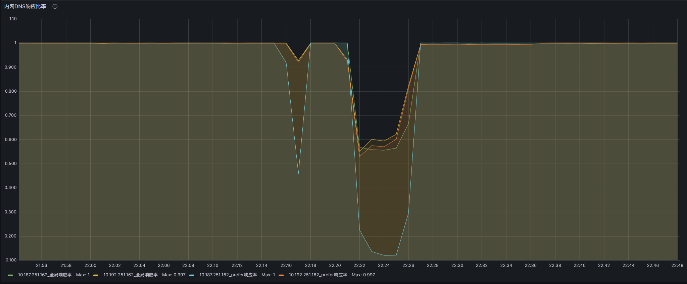
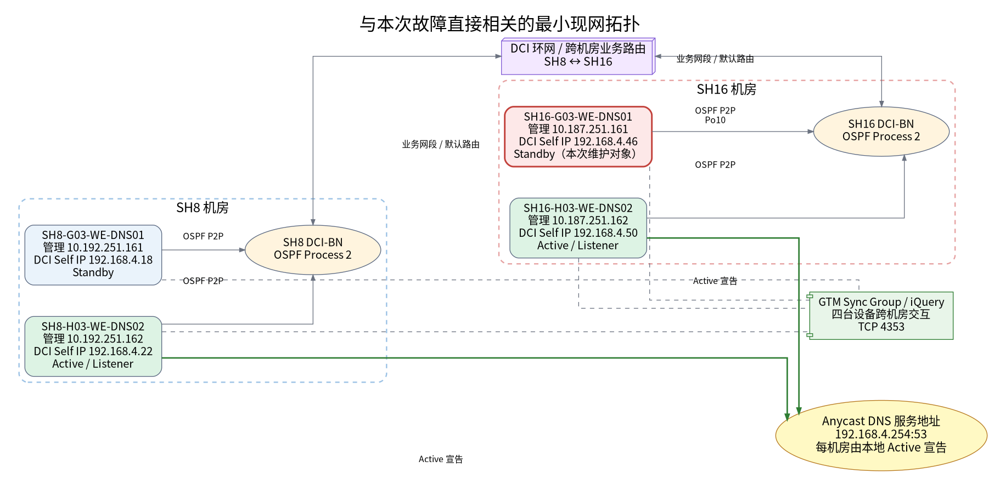
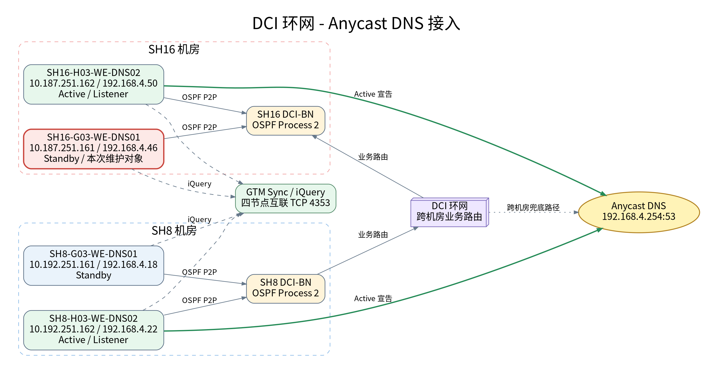
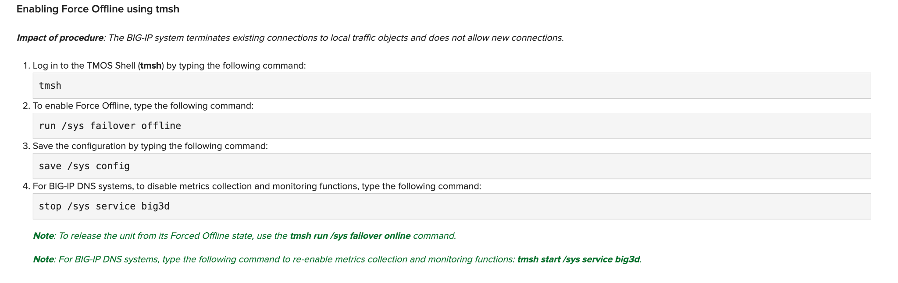
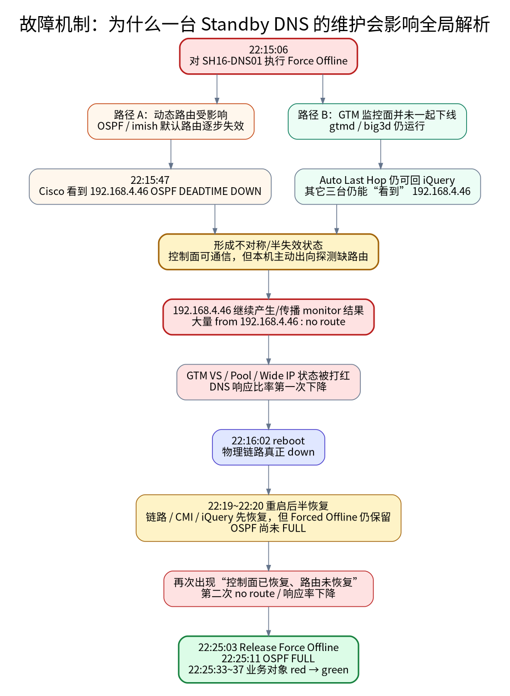

## 00. 异常起点

某次维护窗口内，对双活数据中心中的一台 F5 DNS 设备 `SH16-G03-WE-DNS01.COM` 进行维护。

这台设备在 SH16 本地 HA 中是 **Standby**，真正承载 SH16 机房 `192.168.4.254:53` Anycast DNS Listener 的是另一台 Active 设备 `SH16-H03-WE-DNS02.COM`。

按照最直观的理解：

- 维护的是 Standby；
- Active 仍然在线；
- DNS 服务地址并没有直接漂移到被维护设备；
- 因此，正常情况下不应该出现整个 DNS/GTM 业务面明显下降。

但 Grafana 给出的事实恰恰相反：维护窗口内，内网 DNS 响应比率出现了**两次非常明显的下降**。



**这就是整个排障故事的起点：**

> 为什么维护一台 Standby DNS，会让双中心 DNS/GTM 的整体响应率下降？

这个问题一开始并没有答案，而且后续事实证明，如果只从“主备切换”和“Listener 是否漂移”这两个角度看，几乎一定会走偏。

---


## 01. 现网架构

双中心内网 WE-DNS 共四台：

| 机房 | 设备 | 管理 IP | DCI Self IP | 事件后采集时 HA 角色 |
|---|---|---:|---:|---|
| SH8 | SH8-G03-WE-DNS01 | 10.192.251.161 | 192.168.4.18 | Standby |
| SH8 | SH8-H03-WE-DNS02 | 10.192.251.162 | 192.168.4.22 | Active |
| SH16 | SH16-G03-WE-DNS01 | 10.187.251.161 | 192.168.4.46 | Standby，**本次维护对象** |
| SH16 | SH16-H03-WE-DNS02 | 10.187.251.162 | 192.168.4.50 | Active |

两地分别组成 HA，对外提供同一个 Anycast DNS 服务地址：

```text
192.168.4.254:53
```

同时，四台设备又处于同一个 GTM/DNS 体系中，存在跨机房的 sync/iQuery、监控状态传播以及对各类 GTM Server/Virtual Server 的健康检查。



WE-DNS 通过 DCI-BN 进行三层互联，WE-DNS 与 DCI-BN 之间运行 OSPF，双中心通过 DCI 环网承载业务网段和 DNS 相关路由。



设计图中的关键说明如下：

1. SH8 的两台 WE-DNS 为主备模式，SH16 的两台 WE-DNS 同样为主备模式；四台设备处于跨机房集群体系并进行配置同步。
2. WE-DNS 通过双 10G 链路捆绑接入单台 DCI-BN，并采用三层互联。
3. WE-DNS 与 DCI-BN 之间运行 OSPF P2P，DCI-BN 使用 OSPF Process 2。
4. WE-DNS 通过 OSPF `redistribute kernel` 发布本机监听的 `192.168.4.254` DNS 服务地址；只有当前 Active 设备监听并对外发布该地址。
5. WE-DNS 配置默认静态路由，下一跳指向与 DCI-BN 的三层互联地址；DCI-BN 再将 OSPF Process 2 学到的相关路由重发布到 BGP，并通过 route-map 控制发布范围。
6. SH8 或 SH16 机房服务器访问 `192.168.4.254` 时，DCI-BN 根据路由 Metric 优选本机房的 WE-DNS。
7. 单台 Active WE-DNS 故障时，对端 Standby 接管并发布 `192.168.4.254`，外部访问继续由本机房承接。
8. 单机房两台 WE-DNS 均不可用时，到 `192.168.4.254` 的访问可经 DCI 环网引流至对端机房 WE-DNS。
9. `192.168.4.x` 相关路由用于双活网段内部，不向其它无关机房发布。

这里很快得到第一个重要认识：

> **“Standby 不承载本机房 Listener”并不等于“Standby 对整个 GTM 体系没有作用”。**

一台 DNS 设备即使不是本地 `192.168.4.254` 的 Active Listener，它仍可能：

- 作为 GTM sync group 成员；
- 通过 iQuery 与其它 BIG-IP DNS 设备通信；
- 运行 `gtmd`、`big3d`；
- 作为某些 monitor/prober 的执行节点；
- 参与 OSPF 和业务网段路由。

这一步把问题从“HA 主备切换”扩大到了“**DNS Listener、GTM 控制面、健康检查面、动态路由面之间是否存在状态不一致**”。

---


## 02. 基础核对


第一轮采集主要围绕几个问题：

1. `SH16-DNS01` 到底是不是 Standby？
2. `192.168.4.254` 属于哪个 Traffic Group？
3. 两台 SH16 DNS 是否 In Sync？
4. GTM_WGSH8 / GTM_WGSH16 当前是否正常？
5. OSPF 邻居和路由是否正常？

采集内容包括：

```bash
tmsh show sys failover
tmsh show cm sync-status
tmsh show cm traffic-group
tmsh show cm device-group /Common/group_HA
tmsh show ltm virtual-address /Common/192.168.4.254

tmsh list cm traffic-group /Common/traffic-group-1 all-properties
tmsh list ltm virtual-address /Common/192.168.4.254 all-properties
tmsh list ltm virtual /Common/listener_TCP /Common/listener_UDP all-properties

tmsh show gtm server /Common/GTM_WGSH8
tmsh show gtm server /Common/GTM_WGSH16
```

这一轮很快确认了：

- SH16-DNS01 的确是 Standby；
- SH16-DNS02 是 Active；
- 配置是 In Sync；
- `traffic-group-1` 正常；
- `192.168.4.254` 是 floating virtual address；
- 从表面 HA 状态看，并不存在“Standby 误抢占 Listener”之类的问题。

所以最开始那个简单解释——“可能主备角色异常了”——基本被排除。


## 03. 时间线


### 3.1. Grafana 异常

Grafana 曲线有两个明显谷值。

这意味着我们不能只问：

> “设备 reboot 时 DNS 有没有抖动？”

而应该改问：

> “第一波下降是什么时候开始的？第二波为什么又出现？两波分别对应什么系统状态？”

于是我们开始在四台 DNS 和 Cisco DCI-BN 上，用统一时间线对齐日志。


### 3.2. no route 前置

SH16-DNS01 日志显示：

```text
Jun  5 22:15:06 SH16-G03-WE-DNS01.COM notice sod[9058]:
010c0044:5: Command: go offline all tmsh.

Jun  5 22:15:06 SH16-G03-WE-DNS01.COM notice sod[9058]:
010c0055:5: Forced offline for traffic group traffic-group-1.
```

就在**同一秒**，GTM monitor 开始报：

```text
Jun  5 22:15:06 ... Monitor instance /Common/tcp_half_9818
10.186.200.88:0 UP --> DOWN from 192.168.4.46 (no route)

Jun  5 22:15:06 ... VS vs_7core.example.internal_10.186.200.88
state change green --> red
( Monitor /Common/tcp_half_9818 from 192.168.4.46 : no route)
```

而真正的 reboot 日志是：

```text
Jun  5 22:16:02 SH16-G03-WE-DNS01.COM err logger[30977]:
shutting down for system shutdown on behalf of root
```

时间关系非常清楚：

```text
22:15:06 Force Offline
    ↓
22:15:06 开始出现 monitor no route
    ↓
22:16:02 才真正 reboot
```

这个证据直接推翻了我们最早的一个自然假设：

> **第一次业务下降不是 reboot 造成的，因为异常在 reboot 前将近一分钟已经发生。**

从这一步开始，调查重点正式从 `reboot` 转向了 `Force Offline`。

---


## 04. 网络佐证

如果只看 F5 日志，仍然存在一种可能：

- `gtmd` 自己报错；
- 或 F5 内部某个组件状态异常；
- 但底层网络其实没有真正发生变化。

因此我们把同一个时间窗拿到 Cisco DCI-BN 上验证。


Cisco 日志：

```text
2026 Jun  5 22:15:47.561 SH16-G03-DCI-BN-SW01
%OSPF-5-ADJCHANGE: ospf-2 [3860]
Nbr 192.168.4.46 on port-channel10 went DOWN

2026 Jun  5 22:15:47.561 SH16-G03-DCI-BN-SW01
%OSPF-5-NBRSTATE: Process 2,
Nbr 192.168.4.46 on port-channel10 from FULL to DOWN, DEADTIME
```

而物理 Po 真正 down 的时间是：

```text
2026 Jun  5 22:16:03.144 ...
Interface port-channel10 is down (No operational members)
```

这三组时间放在一起非常有价值：

| 时间 | 事件 |
|---|---|
| 22:15:06 | Force Offline |
| 22:15:06 | monitor 开始 `no route` |
| 22:15:47 | Cisco OSPF DEADTIME，192.168.4.46 DOWN |
| 22:16:02 | F5 开始 reboot |
| 22:16:03 | Cisco Po10 物理链路 down |

于是证据链从“F5 自己说没路由”升级成了：

> **Force Offline 之后，动态路由邻居确实在 reboot 之前已经消失。**

这是整个排障过程中最重要的时间线反证之一。

---


## 05. 机制分析

到这里又出现了一个新的矛盾：

- 一方面，`192.168.4.46` 的 OSPF 已经 down；
- 另一方面，日志里却仍然能看到大量 “from 192.168.4.46” 的 GTM monitor 结果。

如果一台设备真的彻底下线，它应该既不再有路由能力，也不再参与探测才对。

**但实际并不是这样。**

于是这一轮不再只看现场配置，而是开始把官方机制、TAC 和日志放到一起。


### 5.1. Force Offline

我们重点核对了以下 MyF5 资料：

- [`K00409413`](https://my.f5.com/manage/s/article/K00409413)：BIG-IP 在 disabled/offline 状态下不会通告高级动态路由协议路由；
- [`K15122`](https://my.f5.com/manage/s/article/K15122)：Force Offline 不会自动停止 BIG-IP DNS 的 metrics collection / monitoring functions；
- [`K11661449`](https://my.f5.com/manage/s/article/K11661449)：BIG-IP DNS 软件升级/维护流程中会单独涉及停止 `big3d` / `gtmd`；
- [`K39164203`](https://my.f5.com/manage/s/article/K39164203)：动态路由与 `tmrouted/imish` 状态相关。

其中最关键的一点，是官方 Force Offline 说明里明确把 BIG-IP DNS 的监控功能单独列出来：如果要停止监控，需要额外停止 `big3d`。



这一下把之前互相矛盾的两个现象统一起来：

```text
Force Offline
├── 会影响 HA / 高级动态路由行为
└── 但不会自动让 DNS 的 gtmd / big3d 一起停止
```

也就是说，设备可能进入一种非常危险的“半失效”状态：

> **路由面已经不能正常主动出站，但 GTM 监控面仍然活着。**


### 5.2. Auto Last Hop

随后 F5 TAC 又确认了一个关键现象：

其它三台 DNS 向 `192.168.4.46` 发起的 iQuery 请求，仍然可能得到回应。

原因是 **Auto Last Hop**。

这意味着从其它三台 DNS 的视角看：

```text
“192.168.4.46 还能回我的 iQuery，它似乎还活着。”
```

但从 SH16-DNS01 自己主动发包的视角看：

```text
“我的动态路由/默认出向路径已经异常，主动探测目标时 no route。”
```

这就是我们后来在报告里描述的**不对称视角 / 半失效状态**。



从这一刻开始，第一次业务下降已经基本可以解释：

1. Force Offline 触发动态路由异常；
2. `gtmd/big3d` 没有同步退出；
3. Auto Last Hop 让其它 DNS 仍能和它维持部分 iQuery 可见性；
4. `192.168.4.46` 仍然参与/传播健康检查状态；
5. 由于它本身缺少正常出向路由，大量 monitor 结果变成 `no route`；
6. VS / Pool / Wide IP 状态被打红；
7. DNS 响应率下降。

---


## 06. 二次异常

如果第一波已经解释为 Force Offline，那 Grafana 上第二个更深的谷值又是什么？

这个问题迫使我们继续看设备从 reboot 到完全恢复之间的每一个阶段，而不是简单认为“启动完成 = 恢复完成”。


### 6.1. 状态保留

SH16-DNS01 重启后：

```text
Jun  5 22:19:30 ... Forced offline for traffic group traffic-group-1.
Jun  5 22:19:30 ... Forced offline
```

也就是说：

> **reboot 并没有自动清掉之前的 Forced Offline 状态。**


### 6.2. 恢复错位

随后可以看到：

```text
22:20:15  tmrouted starting
22:20:20  trunk_DCI is UP
22:20:21  CMI peer connection established
22:20:27  iQuery SSL handshake complete
22:20:27  Box 192.168.4.46 red --> green
22:20:31  GTM changed state from DOWN to UP
```

从 GTM/iQuery 的角度，设备似乎已经回来了。

但 Cisco 侧直到：

```text
22:25:11  OSPF Nbr 192.168.4.46 went FULL
```

才真正恢复动态路由邻居。

这意味着 22:20～22:25 之间存在一个非常关键的**半恢复窗口**：

```text
链路：UP
CMI：UP
iQuery：UP
GTM Box：green
Forced Offline：仍然存在
OSPF：尚未 FULL
业务出向路由：仍然不完整
```

这正好解释第二次响应率下降：

> 控制面先恢复，使其它 DNS 又认为 `192.168.4.46` 可参与 GTM；但它主动探测所需的业务路由还没有真正恢复，因此再次产生 no route。

---


### 6.3. 恢复点

关键日志：

```text
Jun  5 22:25:03 ... Command: release offline all GUI.
Jun  5 22:25:03 ... Standby
Jun  5 22:25:03 ... HA daemon_heartbeat tmrouted enabled.
```

紧接着：

```text
22:25:11  Cisco OSPF FULL
```

随后：

```text
22:25:33~22:25:37
Monitor DOWN --> UP
VS / Pool red --> green
```

从时间线看，第二次业务恢复和 `release offline → OSPF FULL → monitor success` 完全吻合。

至此，**两次 Grafana 下降都被统一解释了**。

---


## 07. 证据校验

现场看到 OSPF 问题后，一个很容易出现的倾向，是立刻去 F5 Bug Tracker 搜“OSPF / DNS / 15.1.5.1”，然后把某个版本 Bug 套上去。

我们确实检索了本地 F5 Bug Tracker，例如：

- Bug `1076377`：OSPF IA/E route path calculation 错误；
- Bug `1076897`：OSPF `default-information originate` 部分选项异常；
- Bug `1046785`：GTM synchronous probes 超限时可能出现 probes missing / monitor 状态不一致；
- Bug `1128369`：`/Common/bigip` monitor 可能出现 `big3d: timed out`。

这些文档里有些版本范围与现场版本存在重叠，但**Symptoms / Conditions 并不匹配这次事件的直接证据链**。

现场有更强的证据：

- Force Offline 和 no route 同秒出现；
- OSPF DEADTIME 发生在 reboot 前；
- release Force Offline 后 OSPF 立即恢复；
- TAC 能用产品机制解释 `gtmd/big3d + Auto Last Hop` 的不对称状态。

因此这里没有为了“找到一个 Bug”而强行把根因归到 Bug。

这一点对于整个案例非常重要：

> **版本在 Bug 的 affected list 里，只能说明“可能相关”；只有症状、触发条件和现场证据都吻合，才有资格把 Bug 当根因。**

---


## 08. 影响范围

根因基本形成后，排障并没有马上结束。

我们继续把四台 DNS 的 GTM 日志进行整理，按照 `green -> red`、`red -> green`、monitor source、VS、Pool Member、Wide IP 等维度提取受影响对象，并生成 Excel 清单。

这一步的意义不是为了继续找原因，而是为了回答两个管理层和运维层都很关心的问题：

1. 这是“一个域名抖了一下”，还是“成批 GTM 对象被影响”？
2. SH8 和 SH16 的对象是否都受到同一个探测源异常的传播？

通过对象级梳理，我们确认这不是某个单点域名本身的应用问题，而是 GTM 健康检查状态传播后造成的系统性影响。

这一步也让最终故障报告能够从“技术推理”提升到“可量化影响”。

---


## 09. 跨机房探测

排障进入后半段后，我们继续追问一个更细的问题：

> 为什么 SH16 的探测源 `192.168.4.46` 会出现在 SH8 侧对象的 monitor 状态里？


### 9.1. 初始判断

第三批采集专门查看了：

```bash
tmsh list gtm prober-pool

tmsh list gtm datacenter /Common/WGSH8 all-properties
tmsh list gtm datacenter /Common/WGSH16 all-properties
```

看到：

```text
gtm datacenter WGSH8 {
    prober-fallback any-available
    prober-pool none
    prober-preference inside-datacenter
}

gtm datacenter WGSH16 {
    prober-fallback any-available
    prober-pool none
    prober-preference inside-datacenter
}
```

于是最初我们形成了一个合理但还不够强的解释：

- `inside-datacenter` 是偏好；
- `any-available` 允许 fallback；
- 当前没有显式 Prober Pool；
- 因而跨机房 prober 在机制上存在可能性。

同时，`tmsh show` 的 `Reason` 字段中出现了大量：

```text
Monitor ... from 192.168.4.46 : state: success
```

我们一度把这些记录整理成跨机房探测候选清单。


### 9.2. 厂商质疑

F5 TAC/厂商随后指出：

> 仅凭 `Reason : Monitor ... from x.x.x.x`，不能完全证明当前真实的探测源；必须抓包确认。

本地 Bug Tracker 里的 Bug `743726` 也提供了一个有价值的侧面提醒：在特定 Prober Pool 变更条件下，GTM VS tooltip / `tmsh show` 中的 monitor IP 可能显示 stale information，而 debug log 仍保留真实信息。

虽然我们的现场并不完全满足 Bug 743726 的触发条件，因此不能说“我们命中了这个 Bug”，但这条文档强化了一个方法论：

> **GUI / show 输出属于状态展示证据；当源 IP 本身就是争议点时，要升级到 debug 和 packet capture。**

于是我们主动修正了前面的结论：

```text
Reason 字段：候选线索
抓包/debug：最终证据
```

---


## 10. 抓包验证


### 10.1. 网段抓包

为了避免一个 VS 一个 VS 抓，我们先用 F5 的全 TMM 接口抓取方式观察 SH16 到 SH8 `10.191.0.0/16` 的流量：

```bash
tcpdump -ni 0.0:nnn -s0 'dst net 10.191.0.0/16' \
-w /var/tmp/monitor_to_10.191.pcap -vvv
```

随后进一步锁定：

```text
192.168.4.46 -> 10.191.88.14:4353
```

并进行双向抓包。

这个结果非常重要，因为它第一次直接证明：

> **SH16-DNS01 上确实存在发往 SH8 地址 `10.191.88.14` 的 TCP 4353 流量。**

但紧接着又出现新的问题：

> 为什么目的端口是 4353？

如果这是之前认为的普通 `tcp_half_80` / `tcp_half_xxx` 健康检查，端口应该是业务服务端口，不应该是 BIG-IP iQuery 常用的 TCP 4353。于是调查再次转向。

---


## 11. Debug 深挖

为了把“谁在什么机制下发出这个包”搞清楚，现场开启：

```bash
tmsh modify /sys db gtm.debugprobelogging { value "enable" }
tmsh modify /sys db log.big3d.level { value "debug" }
tmsh modify /sys db log.gtm.level { value "debug" }
```

同时采集 qkview。


### 11.1. 异常对象

`server_10.191.88.14` 被配置成：

```text
gtm server /Common/server_10.191.88.14 {
    datacenter /Common/WGSH8
    monitor /Common/bigip
    product bigip
    ...
}
```

而同类普通业务 Server 正常应该是 `generic-host`。

这个发现让 TCP 4353 瞬间有了解释：

> F5 DNS 把 `10.191.88.14` 当成了一台 BIG-IP System，因此会尝试建立 `/Common/bigip` monitor / iQuery / big3d 相关的 4353 通信。


### 11.2. Monitor 真相

对同一个 `10.191.88.14` 的业务 VS，debug 中可以看到类似：

```text
Probe from 192.168.4.18
/Common/tcp_half_80
10.191.88.14:80
state: success
```

并且还有明确的 prober decision：

```text
Will not probe ... because will be done by other GTM
(/Common/GTM_WGSH8:192.168.4.18)
```

于是我们第三次修正了假设：

#### 修正前

```text
192.168.4.46 -> 10.191.88.14
= SH16 prober 正在跨机房探测 SH8 业务 VS
```

#### 修正后

```text
192.168.4.46 -> 10.191.88.14:4353
= server_10.191.88.14 被错误定义为 BIG-IP System 后产生的
  /Common/bigip / iQuery / big3d 相关连接

真正的 tcp_half_80 业务 monitor
= 由 SH8 本地探测源 192.168.4.18 执行
```

这一步非常典型地体现了整个排障方法：

> **一个解释“看起来合理”不代表它是真的。只要下一层证据和解释对不上，就继续拆。**

---


## 12. 假设修正


#### 第一次修正

```text
最初：reboot 导致业务异常
后来：第一次 no route 和 OSPF DOWN 都早于 reboot
结论：Force Offline 才是第一波异常的触发点
```

#### 第二次修正

```text
最初：设备 Force Offline 后应该不再影响 GTM
后来：MyF5 + TAC 证实 gtmd/big3d 不自动停止，Auto Last Hop 仍可回 iQuery
结论：设备进入“控制面仍可见、主动出向路由异常”的半失效状态
```

#### 第三次修正

```text
最初：Reason 字段和 192.168.4.46 -> SH8 地址说明普通业务跨机房探测
后来：抓包看到目的端口 4353；debug + qkview 发现目标被配置为 product bigip
结论：该 4353 流量是 BIG-IP/iQuery 相关连接，不是普通 tcp_half 业务 monitor
```

如果没有这三次修正，最后很容易得到三个“听起来都合理但不准确”的结论：

- “就是 reboot 抖了一下”；
- “就是没配 prober-pool”；
- “就是 F5 某个 Bug”。

而真实问题比这三种说法都复杂。

---


## 13. 故障还原

现在再回看 6 月 5 日晚间，可以把整个过程串成一条完整因果链：


### 阶段一：半失效

`22:15:06` 对 SH16-DNS01 执行 Force Offline。

Force Offline 影响高级动态路由/OSPF，使 SH16-DNS01 的动态路由和主动出向路径逐步失效；但 `gtmd`、`big3d` 并没有一起停止。

其它 DNS 又因为 Auto Last Hop 仍然能得到来自 `192.168.4.46` 的 iQuery 回应，于是 GTM 控制面仍把它视作可参与状态交互的一员。

当 `192.168.4.46` 被用于 monitor/probe 时，本机没有正常出向路由，因此出现大量：

```text
from 192.168.4.46 : no route
```

这些状态通过 GTM 体系传播，批量 VS/Pool/Wide IP 变红，于是 Grafana 出现第一次下降。

### 阶段二：状态残留

`22:16:02` 设备真正 reboot，物理 Po10 随后 down。

重启完成后，Forced Offline 仍然存在。

链路、CMI、iQuery、GTM Box 在 `22:20` 左右逐步恢复，但 OSPF 到 `22:25` 才真正 FULL。

因此再次出现：

```text
控制面恢复了
但路由面还没恢复
```

设备再次可能参与健康检查，又产生 no route，形成第二个更明显的响应率谷值。

### 阶段三：恢复

`22:25:03` 人工 Release Force Offline；

`22:25:11` Cisco 看到 OSPF FULL；

`22:25:33~22:25:37` monitor success、VS/Pool red → green；

DNS 响应指标恢复。

---


## 14. 运维改进


### 14.1. 维护流程

本次故障的本质触发点是 Force Offline 所造成的“动态路由下线，但 GTM monitoring 没同步下线”的组合状态。

因此后续如果目标就是停机重启，维护策略调整为：

```text
确认 HA / 业务影响
→ 直接 reboot
→ 不再先执行 Force Offline
```


### 14.2. 静态路由

避免设备对 imish/OSPF 的默认出向路径形成单点依赖。

目标不是让维护设备“永远能探测”，而是避免再次出现：

```text
动态路由异常
→ 本机完全 no route
→ 监控结果大面积污染 GTM
```


### 14.3. 观察面

后续维护不只看设备“能不能登录”，而是同时看：

- Grafana DNS 请求率 / 响应率 / 响应比；
- `/var/log/gtm` 是否出现 `no route`；
- `gtmd` / `big3d` / iQuery / sync 状态；
- TMM / imish 默认路由；
- Cisco DCI Po / OSPF 邻居；
- GTM VS / Pool / Wide IP 是否持续 red。


### 14.4. Prober Pool

`prober-preference inside-datacenter` + `prober-fallback any-available` + `prober-pool none` 的确说明现网探测源控制还有优化空间。

但本次最终根因不能简化成“没配 Prober Pool”。

Prober Pool 的价值是后续让维护摘除、跨机房 fallback 和探测源范围更加可控。


### 14.5. 半恢复保护

可以评估类似 error-down / 人工恢复的机制，避免：

```text
接口先 UP
GTM/iQuery 先 UP
但 OSPF/业务路由还没完全恢复
```

这种半恢复设备过早重新进入 GTM 探测面。


### 14.6. 对象修正

如果 `10.191.88.14` 并不是真实 BIG-IP Self IP，而只是普通业务服务地址，则：

```text
Product: BIG-IP System
Monitor: /Common/bigip
```

应改回普通 `Generic Host` 模型，并保留 VS 级业务 monitor。

这项问题并不是 6 月 5 日故障的直接根因，却是在进一步深挖“跨机房探测”过程中发现的独立配置隐患。
